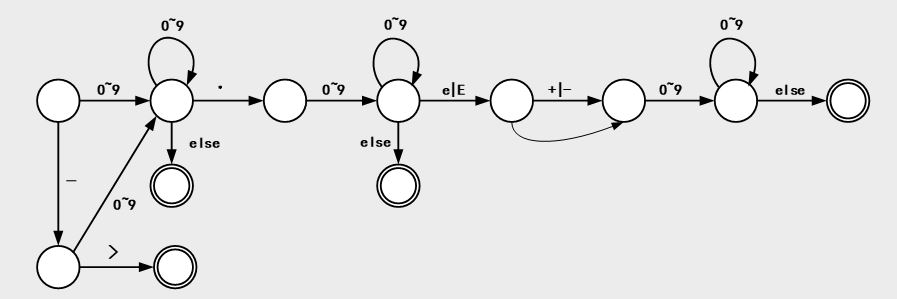
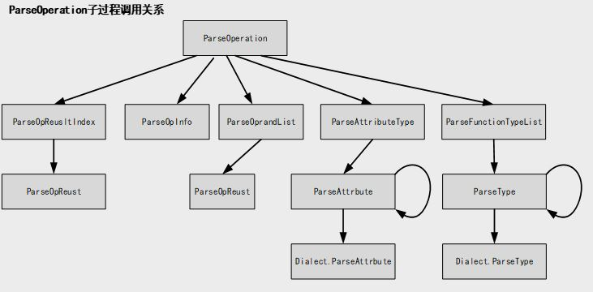

# 为飞桨计算图表示添加parser支持反序列化
## 一、概要
### 1.相关背景
计算图`Computation Graph`是一种用于描述数学计算的图形模型，常用于神经网络的前向传播和反向传播算法中。在计算图中，节点代表数学运算(op)，边代表运算结果之间的依赖关系，形成了一张有向无环图。这个图可以通过一系列的节点之间的计算和数据传递来完成整个计算过程。飞桨和大多数深度学习框架一样，通过某种计算图的中间表示（IR）描述深度学习训练和推理中的计算过程和次序。

飞桨目前提供Printer工具将计算图序列化为文本文件，该项目主要实现反序列化工具Parser,该工具支持将文本文件反序列化为计算图对象。
### 2.项目预期
* 实现Parser的基本功能
  
Parser的基本模块包括词法解析器和递归下降分析程序。该模块可以完成将文本文件分序列化为计算图对象的功能


* Parser具有高可扩展性和健壮性

该项目实现的Parser具有可扩展性，方便其他`Dialect`的接入。另外Parser应对不符合规范的输入应当提过有意义的指示。

  ## 二、设计思路和实现方案
  ### 2.1 整体架构图
  ### 2.2 前置知识概念
  #### `词法分析器Lexer`

  `词法分析器`的主要任务是从左至右逐个字符地对源程序进行扫描，产生一个个单词(Token)符号。单词的种类主要包括有：

  * 基本字
  * 标识符：用来表示各种名字，如op名、参数名等
  * 常数：各种类型的数字，比如整数、浮点数等
  * 运算符：负号等
  * 界符：逗号、分号、括号和空白等
  
  #### `递归下降分析程序`

 `递归下降分析程序`是实现的Parser主要的功能模块，其由一组递归过程组成，对每一语法变量(非终结符)构造一个相应的子程序，识别对应的语法单位，通过子程序间的相互调用实现对输入串的分析。

 ### 2.3 Lexer子模块
 Lexer模块是Parser的子模块，主要功能是从`ifstream`中读取字符，然后为递归下降分析程序提供Token。

 Token的定义如下：

 ``` C++
 class Token {
 public:
  string val_;    //token值
  Token_type token_type_; //token类型
  Token() = default;
  Token(string val, Token_type token_type) {
    val_ = val;
    token_type_ = token_type;
  }
};
```
目前，共定义了如下Token类型：

* EOF:该Token类型表示文件解析完毕
* DIGIT:该Token类型表示整数或浮点数
* SDIGIT:该Token表示科学计数法数字
* VALUEID:该Token表示valueid
* OPNAME:该Token表示opname
* ARRAOW:该Token表示‘->’
* NULL:该Token表示Attribute或Value为空

Lexer模块设计如下：

``` C++

class Lexer {
 private:
  std::istream& is; //待Parser的字符流
  size_t line = 1;  //行指针
  size_t column = 1; //列指针

 public:
  explicit Lexer(std::istream& is) : is(is) {}
  ~Lexer() = default;
  Token ConsumeToken(LexSegment seg);  //获一个Token,并消费掉   
  std::unique_ptr<Token> LexIdentifer(LexSegment seg); //解析一个Identifer
  std::unique_ptr<Token> LexNumberOrArraow(); //解析一个数字或 ‘->’
  std::unique_ptr<Token> LexEndTagOrNullVal(LexSegment seg); //解析空值或终结符（界符）
  std::unique_ptr<Token> LexValueId(); //解析ValueId
  std::unique_ptr<Token> LexEOF();  //解析文件结束标志EOF
  std::unique_ptr<Token> LexOpName(); //解析OpName
  char GetChar(); //在流is中取一个字符
  void SkipWhitespace(); //跳过空白字符
  bool IsEndTag(char, LexSegment); //判断当前字符是否为终结符
  bool IsSpace(char); //判断当前字符是否为空白字符
  size_t GetLine(); //返回line
  size_t GetColumn(); //返回column
  void Unget(const int len);//在字符流中撤销len个字符的读取
};
```
#### 2.3.1 LexerIdentifer函数的实现
Identifier的正则表达式如下：`[a-zA-Z_][a-zA-Z0-9_.]*`。进入LexIdentifier函数首先会判断是不是遇到了字母或下划线，如果不是则返回空。如果是则说明下一个Token为标识符，则不断添加字符到当前Token直到遇到其他字符为止。
```C++

if ((!isalpha(is.peek()) && is.peek() != '_') || IsEndTag(is.peek(), seg)) {
    return nullptr;
  }
  string token_identifier = "";
  while (isalnum(is.peek()) || is.peek() == '_' || is.peek() == '.') {
    token_identifier += GetChar();
  }

```
#### 2.3.2 LexNumberOrArraow函数的实现
该函数主要解析数字和箭头。数字可以为整数、浮点数或者为科学计数法标识的数字。另外，因为`->`由字符'-'和'>'构成，所以`->`也在该函数中进行解析。该函数描述的如下图所示：



#### 2.3.3 LexEndTagOrNullVal函数的实现
该函数主要解析终结符(界符)和空的Attribute或Type，其中Attribute的空值printer将其输出为`<#AttrNull>`,Type的空值printer将其输出为`<<NULL TYPE>>`因为字符'<'本身作为终结符，所以当Lexer遇到字符'<'时会向前peek一个字符，如果遇到的是'<'或'#'则说明此时遇到的是空值。否则将‘<’作为一个单独的终结符返回。
```C++
std::unique_ptr<Token> Lexer::LexEndTagOrNullVal(LexSegment seg) {
  if (!IsEndTag(is.peek(), seg)) { //当前字符是非终结符，返回空
    return nullptr;
  }
  string token_end = "";
  token_end += GetChar();
  if ((token_end[0] == '<' && (is.peek() != '<' && is.peek() != '#')) ||
      token_end[0] != '<') {//如果所遇字符是终结符但是不是"<"则可以直接返回，如果是"<"但是下一个字符不是"<"或"#"说明我们只是单纯遇到了终结符"<"也可以直接返回
    std::unique_ptr<Token> token(new Token{token_end, ENDTAG});
    return token;
  }
  if (is.peek() == '<') { //此时匹配<<NULL TYPE>>
    ...
  } else {//此时匹配<#AttrNull>
   ...
  }
}

```
#### 2.3.4 LexValueId函数的实现
该函数主要解析ValueId，模式为%number。
``` C++
std::unique_ptr<Token> Lexer::LexValueId() {
  if (is.peek() != '%') { //当前字符不是'%'返回空值
    return nullptr;
  }
  while (isdigit(is.peek())) {//如果当前遇到数字则加入当前token
    ...
  }

}
```
#### 2.3.5 LexEOF函数的实现
如果遇到`EOF`标志则直接返回Parser结束标志，否则返回空值。

#### 2.3.6 LexOpName函数的实现
如果当前遇到的字符是“则说明遇到的是opname,此时解析一个Identifer即可。

#### 2.3.7 GetChar函数的实现
该函数从流中取到字符之后直接返回，但是需要同时更新line和column信息
```C++
char Lexer::GetChar() {
  char c = is.get();
  if (c == '\n') {//当前遇到换行符，则line自增，column归零
    line++;
    column = 1;
  } else { //否则column自增
    column++;
  }
  return c;
}
```

#### 2.3.8 IsEndTag和IsSpace函数的实现
在IsEndTag中定义终结符，目前共支持如下终结符：

> { } ( ) : < > , [ ] + = 

在IsSpace函数中定义空白字符，目前支持四种：

> ' ' , '\n' , '\t' , '\f'

#### 2.3.9 ConsumeToken函数的实现
该函数依次调用上述以Lex开头命名的函数，如果返回值为空，则说明当前Token不是该函数所描述的，有且仅有一个函数可以成功解析该Token并且返回。


```C++
Token Lexer::ConsumeToken(LexSegment seg) {
  SkipWhitespace();  //首先跳过空白字符
  if (auto token = LexIdentifer(seg)) { //尝试解析Idetifer
    return *token;
  } else if (auto token = LexNumberOrArraow()) {//尝试解析箭头或数字
    return *token;
  } else if (auto token = LexEndTagOrNullVal(seg)) {//尝试解析界符或空值标志
    return *token;
  } else if (auto token = LexValueId()) {//尝试valueid
    return *token;
  } else if (auto token = LexOpName()) {//尝试解析opname
    return *token;
  } else if (auto token = LexEOF()) {//尝试解析EOF
    return *token;
  } else {
    return Token{"Error", NULL_};//错误
  }
}
```
#### 2.3.10 Unget的实现
```C++
void Lexer::Unget(const int len){
  if(is.eof()){//如果此时已经读到流的结束位置，则重置is
    is.clear();
  }
  column -= len;
  is.seekg(-len,std::ios::cur);//调用seekg函数，修改is的位置
}
```
### 2.4 Parser模块
Parser模块实现将序列化文件反序列化为计算图的功能。

#### 2.4.1 Parser对象的数据成员
* Lexer : 词法分析器对象，主要功能是向递归下降分析程序提供Token。[Lexer实现](#23-lexer子模块)
* Builder : 构造器对象，主要功能是完成基础Attribute或Type的构建
* OpResultMap : 该Map类型为`Map<string,OpResult>`，当Create一个Op之后，将该Op的OpResult对应的ValueId作为Key，OpResult本身作为Value放入该Map中。如果该Op的OpResult作为后续Op的OpRand，那么，直接从该Map中获取即可。
* IrContext : 该对象管理所有注册的方言，Parser在工作过程中会通过此对象得到OpInfo以及通过DialectName得到对应的Dialect对象。
* 
#### 2.4.2 Parser递归下降程序框图

主要思路是分析程序程序由一组递归过程组成，递归下降分析程序的主要设计思路是：对每一语法变量(非终结符)构造一个相应的子程序，识别对应的语法单位，通过子程序间的相互调用实现对输入串的分析。


#### 2.4.3 ParseOpResultIndex的实现
该函数主要实现对`OpResultList`的Parser,`OpResultList`的文法定义如下：

> OpResultList ::= ValueList 
> 
> ValueList ::= ValueId(,ValueId)*
> 
> ValueId ::= "%"Digit


根据`OpResultList`的文法定义，代码实现逻辑如下：
```C++
// TODO 函数名改为ParseOpResultList
vector<string> IrParser::ParseOpResultList() {
  获取左括号；
  Token index_token = ConsumeToken();
  while (index_token.val_ != ")") { //如果当前的Token是右括号说明ParseOpResultList结束
    if (index_token.token_type_ == NULL_) {//检查是否为空值
      opresultindex.push_back("null");
    } else {
      string str = index_token.val_;
      opresultindex.push_back(str);
    }
    if (ConsumeToken().val_ == ")") break;//eat 逗号，如果发现是右括号说明ParseOpResultList结束
    index_token = ConsumeToken();
  }
  return opresultindex;
}
```
#### 2.4.4 ParseOpInfo的实现
序列化文件中并未有给出`OpInfo`信息，原因是在IrContext对象中有`GetRegisteredOpInfo`方法，为该方法传入OpName参数，即可得到该Op的`OpInfo`.定义OpName的文法为：

>OpName ::= "\\"" StringIdentifer "." StringIdentifer "\\""

所以ParserOpInfo的实现思路是，通过解析出OpName然后调用IrContext中的GetRegisteredOpInfo函数得到对应的OpInfo，主要代码如下：

```C++

OpInfo IrParser::ParseOpInfo() {
  Token opname_token = ConsumeToken();
  string opname = opname_token.val_;//得到OpName
  return ctx->GetRegisteredOpInfo(opname);//返回opinfo
}
```
#### 2.4.5 ParseOpRandList的实现
`OpRandList`和`OpResultList`的定义相同，其文法描述为：

> OpRandList ::= ValueList 
> 
> ValueList ::= ValueId(,ValueId)*
> 
> ValueId ::= "%"Digit

IR采用`SSA`模式，一个`OpResult`只可能作为一个Op的`OpRand`。在Parser中有数据成员OpResultMap。该Map类型为`Map<string,OpResult>`，当Create一个Op之后，将该Op的OpResult对应的ValueId作为Key，OpResult本身作为Value放入该Map中。如果该Op的OpResult作为后续Op的OpRand，那么，直接从该Map中获取即可。所以在解析OpRandList时我们遇到的`ValueId`必定会在之前被创造出来并且已经放入OpResultMap中，我们只用`ValueId`作为key便可以直接拿到对应的`OpResult`。这里虽然是在解析`OpRand`但是我们返回值类型是`OpResult`，这是因为这两种类型可以在Create一个Op时进行转化。

```C++
vector<OpResult> IrParser::ParseOpRandList() {
  得到左括号；
  std::vector<OpResult> inputs{};
  ······
  while (ind_token.val_ != ")") {
    string t = "";
    if (ind_token.token_type_ == NULL_) {//如果为空类型，创造一个新的空类型
      inputs.push_back(GetNullValue());
    } else {
      t = ind_token.val_;
      inputs.push_back(opresultmap[t]);//直接在OpResultMap中得到对应的OpResult
    }
    ······
  return inputs;
}
```

#### 2.4.6 ParseAttributeMap的实现
AttributeMap的文法定义如下：

> AttributeMap ::= "{" (AttributeEntry(,AttributeEntry)*) "}"
> 
> AttributeEntry ::= StringIdentifer ":" Attribute

文法中所描述的`Attribute`是一个基类型，可以为`StrAttribute`、`Int32Attribute`、`BoolAttribute`等。另外，其他方言中也可以自定义`Attribute`.

*ParseAttributeMap的难点和解决方案*

1. 如何确定一个`Attribute`的具体类型。比如`is_test:0`是一个AttributeEntry，但是当我们拿到“0”这个Token时是将其解释为`Int32Attribute`还是`BoolAttribute`或者是`Int64Attribute`？

该问题的解决方法是修改`Attribute`的Print方式，按照`(类型)值`的形式打印一个`Attribute`。特别的，针对`BoolAttribute`打印方式由 0/1 变为 true/false.这样可以解决上述问题。

修改后的print方法和修改前输出的`AttributeMap`输出对比如下：

* 修改前

> {data_format:NCHW,dilations:array[1,1],padding_algorithm:EXPLICIT,paddings:array[0,0],stop_gradient:array[0],strides(Array):array[1,1]} 
* 修改后

> {data_format:(pd.DataLayout)NCHW,dilations:(Array)[1,1],padding_algorithm:(String)EXPLICIT,paddings:(Array)[0,0],stop_gradient:(Array)[0],strides(Array):(Array)[1,1]} 

根据修改后的`Attribute`打印特点可以在构建一个`Attribute`之前就预先知道其为何种类型。这样可以准确构造出每一个`Attribute`.

1. builtin方言中定义的`Attribute`直接在Parser中进行Parse,其他方言自定义的`Attribute`怎么进行Parser?
   
   该问题的解决方案是在`Dialect`接口中增加一个虚函数`ParseAttribute`该函数负责本方言自定义的`Attribute`的Parse。修改之后的接口如下：

 ```C++
  class IR_API Dialect {
  ······
  virtual Attribute ParseAttribute(ir::IrParser &parser) {  // NOLINT
    IR_THROW("dialect has no registered attribute parsing hook");
  ......
  }
   ```
新加入的方言如果自定义了`Attribute`就需要实现该函数。如何确定一个`Attribute`属于哪一个方言？如果一个`Attribute`是一个新的Dialect自定义的，那么在打印该`Attribute`的类型时需要以`DialectName.AttributeName`的形式打印，这样就可以确定该`Attribute`所属的方言了。

综上，Parser所提供的`ParseAttribute`方法的实现逻辑如下：

```C++
Attribute IrParser::ParseAttribute() {
  auto parenthesis_token = GetToken();
  string attribute_type = PeekToken().val_; //获得当前Attribute的类型
  if(是builtin方言中定义的Attribute){
    调用builder对象中的函数构造Attributr返回；
  }else if(是Array类型){
    递归调用ParseAttribute()
  }else{
    //当前Attribute是定义在其他方言中的
    auto dialect_name = attribute_type.substr(0, attribute_type.find('.'));
    auto dialect = ctx->GetRegisteredDialect(dialect_name);//拿到所属的方言对象
    return dialect->ParseAttribute(*this);//执行方言自定义的ParseAttribute方法
  }
}
```
#### 2.4.7 ParseTypeList的实现

FunctionTypeList的文法定义为:

> FunctionTypeList ::= TypeList "->" TypeList
> 
> TypeList ::= Type(",",Type)*

所以实现`ParseFunctionType`的核心是实现`ParseType`方法。

*ParseType的实现难点和解决方案*

1. 如何确定当前需要Parse的Type定义在哪个方言中？

ParseType的设计思路和ParseAttribyute的设计思路类似：在Parser程序中实现builtin方言中定义的基础类型的Parse,其他方言自定义的Type则由方言中的ParseType方法来完成，这里同样修改了Dialect接口，新加如下虚函数：

```C++
class IR_API Dialect {
  ······
  virtual Type ParseType(ir::IrParser &parser) {  // NOLINT
    IR_THROW("dialect has no registered type parsing hook");
  }
  ......
  }
```
当Parser确定当前类型不属于builtin方言时就需要转到定义该Type的方言的ParseType函数，使用该函数来完成自定义Type的Parse.

根据当前Token确定当前Type定义在哪个方言中的方案是规定方言实现的PrintType按`DialectName.TypeName`格式打印Type的名称。这样可以通过`DialectName`在IrContext对象中使用GetRegisteredDialect函数得到相应的Dialect对象。

* 修改前

> tensor<256x64x1x1xf32>,tensor<1024x256x1x1xf32>,
tensor<256x1024x1x1xf32>,tensor<256x256x3x3xf32>,
tensor<1024x256x1x1xf32>,tensor<256x1024x1x1xf32>


* 修改后

> pd.tensor<256x64x1x1xf32>,pd.tensor<1024x256x1x1xf32>,
pd.tensor<256x1024x1x1xf32>,pd.tensor<256x256x3x3xf32>,
pd.tensor<1024x256x1x1xf32>,pd.tensor<256x1024x1x1xf32>

综上，Parser中的ParseType函数实现逻辑：

```C++
Type IrParser::ParseType() {
  Token type_token = PeekToken();
  string type_val = type_token.val_; //获得当前type的名称
  if(是builtin方言中定义的Type){
    调用builder对象中的函数构造Type返回；
  }else if(是Array类型){
    递归调用ParseType()
  }else{
    auto dialect_name = type_val.substr(0, type_val.find('.'));
    auto dialect = ctx->GetRegisteredDialect(dialect_name);//获得dialect对象
    return dialect->ParseType(*this);//执行Dialect对象定义的ParseType
  }
}
```

### 2.5 Pd_dialect相关的修改
为了配合`ParseAttribute`和`ParseType`方法，在Dialect接口中增加了两个虚函数：

```C++
  virtual Attribute ParseAttribute(ir::IrParser &parser) {  // NOLINT
    IR_THROW("dialect has no registered attribute parsing hook");
  }
   virtual Type ParseType(ir::IrParser &parser) {  // NOLINT
    IR_THROW("dialect has no registered type parsing hook");
  }
```
自定义`Dialect`如果自定义了`Type`或`Attribute`则需要实现这两个函数用于自定义`Type`或`Attribute`的Parse.

#### 2.5.1 pd方言中ParseType的实现

pd方言中自定义了`tensor` Type类型，`tensor`的输出举例如下：

```
pd.tensor<256x64x1x1xf32>,pd.tensor<1024x256x1x1xf32>,
pd.tensor<256x1024x1x1xf32>,pd.tensor<256x256x3x3xf32>,
pd.tensor<1024x256x1x1xf32>,pd.tensor<256x1024x1x1xf32>
```
根据Type的print方案，所实现的Parse方法如下：

```C++
ir::Type PaddleDialect::ParseType(ir::IrParser &parser) {  // NOLINT
  eat tensor;
  eat <;
  std::vector<int> dim{};
  Token dim_token = parser.PeekToken();
  while (dim_token.token_type_ == DIGIT) {
    if(peek_token_val[0] != 'x'){
      break;
    }
    parser.ConsumeToken();
    parser.lexer->Unget(peek_token_val.size()-1);
    //以parse  tenser<256xf32>为例
    //lexer会认为xf32是一个token,不过没关系,我们只取'x'
    //剩余的字符放回字符流中,这样得到的下一个token就是f32
    //这样就解决了字符'x'二义性的问题。
  }
  phi::DDim ddim = phi::make_ddim(dim);
  ir::Type dtype = parser.ParseType();//parse datatype
  eat >;
  //datalayout信息和lod信息使用默认值
  return DenseTensorType::get(
      parser.ctx, dtype, ddim, phi::DataLayout::UNDEFINED, lod, 0);
}
```

这里的`lod`信息采用默认值，这是因为`lod`后期会被取消掉。


#### 2.5.2 ParseAttribute的实现
pd方言中共定义了一下`Attribute`；

* IntArrayAtttribute
* DataTypeAttribute
* PlaceAttribute
* DataLayoutAttribute
* ScalarAttribute

其中`ScalarAttribute`是`BoolAttribute`,`Int32Attribute`,`Int64Attribute`,`DoubleAttribute`,`FloatAttribute`的抽象，它可以为这五个类型之一。所以这里直接将`ScalarAttribute`Parse成这5个`Attribute`之一。

根据之前对于`Attribute`的Printer的约定，pd中的`ParseAttribute`实现如下：

```C++
ir::Attribute PaddleDialect::ParseAttribute(ir::IrParser &parser) {  // NOLINT
   ······
  if (attribute_name == "IntArray") {
    return IntArrayAttribute::Parse(parser);
  } else if (attribute_name == "DataType") {
    return DataTypeAttribute::Parse(parser);
  } else if (attribute_name == "Place") {
    return PlaceAttribute::Parse(parser);
  } else if (attribute_name == "DataLayout") {
    return DataLayoutAttribute::Parse(parser);
  } else {
    IR_THROW("No function parsing " + attribute_name + " exists!");
  }
}

```

可以看出这里`ParseAttribute`的实现主要是首先对`Attribute`的类型进行初步判断，然后再去调用对应`Attribute`类中的静态Parse方法去构造出相应的`Attribute`.所以这里在对应的`Attribute`类中需要事项相应的Parse静态方法完成Parse.

## 三、Parser使用说明
### 3.1 Parser对新加入方言的支持
新加入`Dialect`如果有自定义的`Type`或者`Attribute`,在该方言中必须实现对应的`Type`和`Attribute`的`Printer`和`Parser`方法。
其中在打印`TypeName`时，应按如下格式打印：
> DialectName.TypeName

打印`Attribute`时，应按如下格式打印，
> (DialectName.AttributeName)AttributeValue

例如，新建方言`TestParserDialect`用于测试Parser对新加入方言的支持。在该方言中加入`CharAttribute`。
则按照前述要求，需要实现`PrintAttribute`为：
```C++
void TestParserDialect::PrintAttribute(ir::Attribute attr,
                                       std::ostream& os) const {
  auto byte_attr = attr.dyn_cast<CharAttribute>();
  os << "(tp.char)" << byte_attr.data();
}
```
对应的所实现的`ParserAttribute`为：
```C++
ir::Attribute TestParserDialect::ParseAttribute(
    ir::IrParser& parser) {  // NOLINT
  std::string type_name = parser.GetToken().val_;
  std::string parenthesis_token_val = parser.GetToken().val_;
  IR_ENFORCE(parenthesis_token_val == ")",
             "The token value of expectation is ), not " +
                 parenthesis_token_val + "." + parser.GetErrorLocationInfo());
  return CharAttribute::Parse(parser);
}
```
则加入Printer出的op如下：
> (%0) = \"builtin.get_parameter\" () "
      "{parameter_name:(String)conv2d_0.w_0,test:(tp.char)a} : () -> "
      "pd.tensor<64x3x7x7xf32>

这里的`test:(tp.char)a`是`TestParserDialect`自定义`Attribute`的Printer输出。
当`IrParser`中的`ctx`注册了`TestParserDialect`之后，当`IrParser`处理到`(tp.char)`时,`IrParser`程序就可以根据`DialectName`找到`Dialect`对象，执行里面预置的`ParserAttribute`方法。

### 3.2 对外提供的接口Parser
#### 3.2.1 如何反序列化Program
参考代码如下：
```cpp
ir::IrContext *ctx = ir::IrContext::Instance();
ctx->GetOrRegisterDialect<PaddleDialect>();

std::ifstream program_text(file_path);
std::unique_ptr<ir::Program> program = ir::Program::Parse(program_text,ctx);
std::cout << *program << std::endl;
```

可以参考`test/cpp/ir/core/program_translator_test.cc`的`IrParserTest`，提供了例子。

#### 3.2.2 如何反序列化Type/Attribute

`Type`和`Attribute`的Parse方式和Program类似，如下：
```cpp
std::stringstream attr_text("(Array)[(pd.DataType)bool,(pd.DataType)float32,(pd.DataType)float64]");
auto attribute = ir::Program::Parse(ctx, attr_text);
std::cout << attribute << std::endl;
```
可以参考`test/cpp/ir/core/ir_parser_test.cc`和`test/cpp/ir/core/TestParserText.txt`。
## 四、ir_parser_test
`ir_parser_test`支持以txt文件的形式提供测试数据。它的功能类似于一个简单的`filecheck`。目前支持对`Attribute`,`type`,`program`三种结构的测试，txt测试数据文件的格式举例如下：
> //CHECK attribute
> 
> (String) sdfgs.sdsd
> 
> //CHECK type
> 
>pd_op.tensor<256xf32>
>
>//CHECK program
>
>{ }

首先,第一行需要给出`//CHECK`标志,然后给出是`type`,`attribute`,`program`中的哪一种类型的测试,之后在第二行开始给出对于的序列化字符串.

`ir_parser_test`会解析上述内容拿到对应的字符串,利用字符串parse出`type`,`attribute`或`program`,再调用相应的print方法对比进行反序化之前的内容.
这里并没有直接对比两个字符串的内容,而是比较两个字符串解析得到的`Token`,这是为了给写txt文本时留一些格式上变通的空间。


